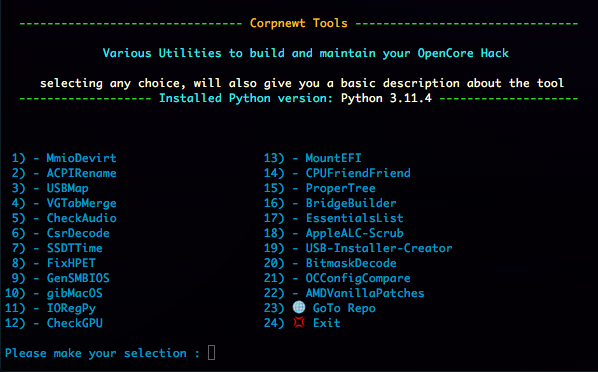
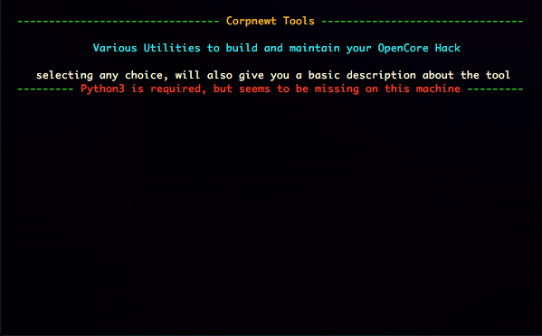
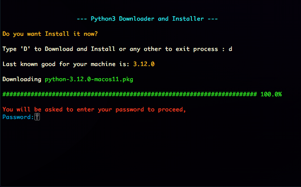

# Corpnewt-Utilities Downloader
Simple Downloader for Corpnewt Tools, a personal selection of Various Utilities to build and maintain your Hackintosh

#

#
Since all tools use Python, it will also check if it is already present

#
and eventually Downloaded and Installed on the fly

#
[Download](https://raw.githubusercontent.com/LAbyOne/Corpnewt-Utilities/main/images/Corpnewt%20Utilities.dmg)

#
Credits:

[Corpnewt](https://github.com/corpnewt)
for creating an maintaining all the Utilities listed on this tool

[Me](https://github.com/LAbyOne), well i just wrote the Downloader...

Corpnewt-Utilities-Downloader
